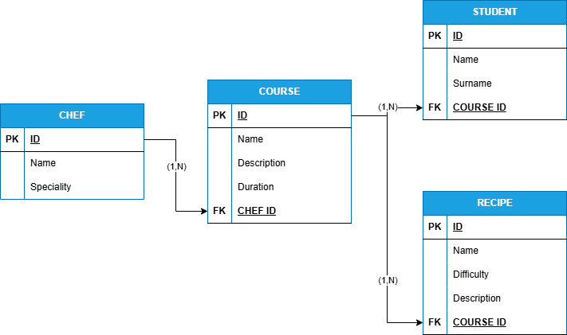

# 🍳 Cooking School Management System

This project contains a Java program that manages data for a **Cooking School**, allowing users to handle **chefs, courses, students, and recipes**.  
The program uses **SQLite** as a local database and provides a text-based menu interface to perform CRUD (Create, Read, Update, Delete) operations on each entity

## Development Environment Information

- **Operating System:** Windows 10 / 11  
- **IDE used:** Visual Studio Code or IntelliJ IDEA  
- **Java version:** Java 24  
- **Database:** SQLite  
- **Libraries used:** java.sql for database connection and queries, java.util for scanner and collections, org.sqlite.JDBC for SQLite driver

## How to Run the Program

1. Clone or download this repository.  
2. Add the **SQLite JDBC driver** to your project’s classpath   
3. Run the file **Main.java**  
4. Follow the screen instructions to navigate through the menu:


## Diagram of the database



## Database Schema

The database for the Cooking School Management System consists of the following tables:

```sql
CREATE TABLE Chef (
    id INTEGER PRIMARY KEY AUTOINCREMENT,
    nombre TEXT NOT NULL,
    especialidad TEXT
);

CREATE TABLE Curso (
    id INTEGER PRIMARY KEY AUTOINCREMENT,
    nombre TEXT NOT NULL,
    chef_id INTEGER,
    duracion INTEGER,
    FOREIGN KEY (chef_id) REFERENCES Chef(id)
);

CREATE TABLE Receta (
    id INTEGER PRIMARY KEY AUTOINCREMENT,
    curso_id INTEGER,
    nombre TEXT NOT NULL,
    dificultad TEXT,
    FOREIGN KEY (curso_id) REFERENCES Curso(id)
);

CREATE TABLE Alumno (
    id INTEGER PRIMARY KEY AUTOINCREMENT,
    nombre TEXT NOT NULL,
    curso_id INTEGER,
    FOREIGN KEY (curso_id) REFERENCES Curso(id)
);

   


